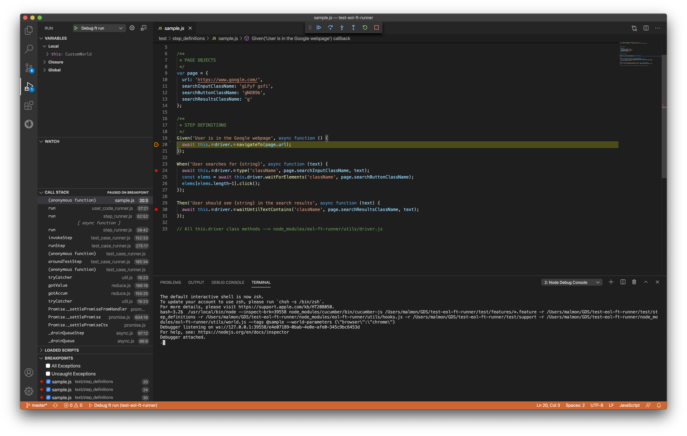

## Debugging and breakpoints in VSCode
For debugging your tests in VisualStudio Code, the following configuration can be copied in to `launch.json` file under VSCode **Run** tab
```markdown
{
    // Use IntelliSense to learn about possible attributes.
    // Hover to view descriptions of existing attributes.
    // For more information, visit: https://go.microsoft.com/fwlink/?linkid=830387
    "version": "0.2.0",
    "configurations": [
        {
            "type": "node",
            "request": "launch",
            "console": "integratedTerminal",
            "name": "Debug ft run",
            "program": "${workspaceFolder}/node_modules/cucumber/bin/cucumber-js",
            "args": [
                "${workspaceFolder}/test/features/*.feature",
                "-r",
                "${workspaceFolder}/test/step_definitions",
                "-r",
                "${workspaceFolder}/node_modules/eol-ft-runner/utils/hooks.js",
                "-r",
                "${workspaceFolder}/test/support",
                "-r",
                "${workspaceFolder}/node_modules/eol-ft-runner/utils/world.js",
                "--tags",
                "<tag_name>",
                "--world-parameters",
                "{\"browser\":\"chrome\"}"
            ]
        }
    ]
}
```

You can set breakpoints in your step definition files to halt the execution and run through each step one-by-one. This is especially useful when debugging your tests for errors by watching variables or functions and override set values.
